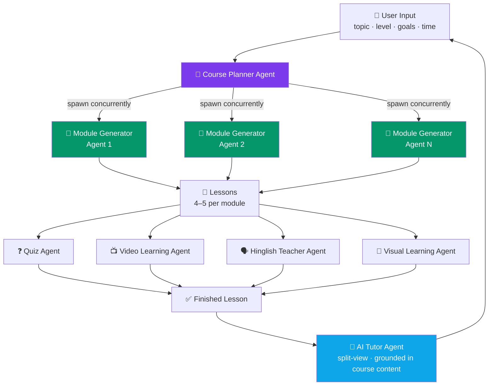
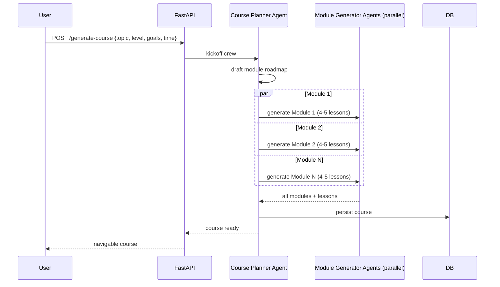
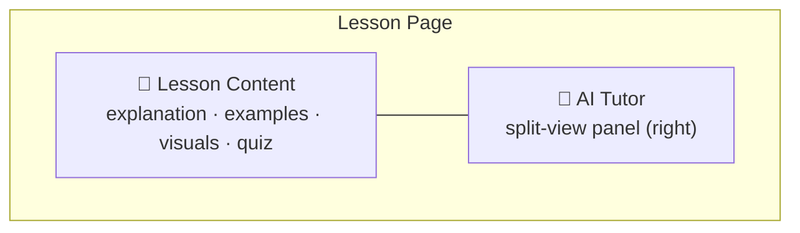

# 🧠 AI Learning Platform — Multi-Agent Architecture Plan

> **Note:** Supersedes the earlier stack in `REQUIREMENTS.md` (Node/Express/Gemini/Render) — this spec moves to **FastAPI + CrewAI**, deployed entirely on **Vercel**.

## Stack

| Layer | Choice |
|---|---|
| Backend | FastAPI (Python) |
| Frontend | Deployed on Vercel |
| Backend hosting | Deployed on Vercel |
| Agent orchestration | CrewAI (multi-agent) |
| LLM provider | Google Gemini API (powers all CrewAI agents) |
| UI/UX | Premium, animated, polished — smooth motion, strong typography |

---

## Agent Orchestration

---

## Concurrent Course Generation Flow

*Concurrency across Module Generator Agents is the key lever for cutting total generation time.*

---

## Agent Responsibilities

| Agent | Responsibility |
|---|---|
| **Course Planner** | Builds the roadmap from topic/level/goals/time; spawns Module Generator Agents concurrently |
| **Module Generator** (×N) | One module each — 4–5 lessons with explanations, examples, interactive exercises, takeaways, embedded visuals |
| **Quiz Agent** | End-of-lesson quiz (MCQ / True-False / fill-blank / coding); instant grading, explanations, progress tracking |
| **Video Learning Agent** | 2–3 relevant YouTube videos; on-demand AI notes (summary, key concepts, timestamps, revision notes, takeaways) |
| **Hinglish Teacher Agent** | "Explain in Hinglish" button → simplified Hinglish text + natural audio narration |
| **Visual Learning Agent** | Mind maps, flowcharts, concept maps, process diagrams, timelines, comparison tables |
| **AI Tutor Agent** | Persistent split-view panel; answers grounded in course content, simplifies concepts, real-time doubt resolution |

---

## Lesson Page Layout

