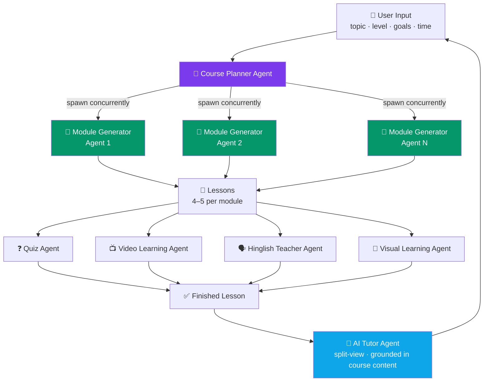
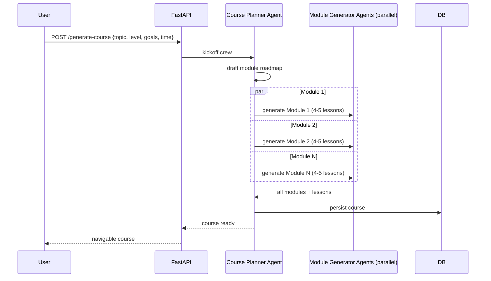
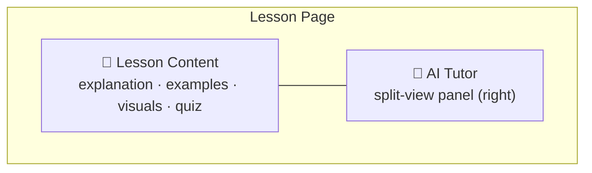
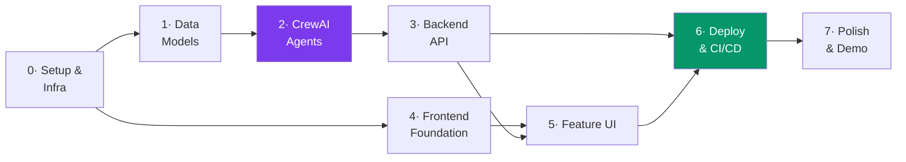

# 🧠 AI Learning Platform — Multi-Agent Architecture Plan

> **Note:** Supersedes the earlier stack in `REQUIREMENTS.md` (Node/Express/Gemini/Render) — this spec moves to **FastAPI + CrewAI**, deployed entirely on **Vercel**.

## Stack

| Layer | Choice |
|---|---|
| Backend | FastAPI (Python) |
| Frontend hosting | Vercel |
| Backend hosting | Render (long-running process — CrewAI runs exceed Vercel/Lambda function timeouts) |
| Database | MongoDB — Docker locally, Atlas (managed, free tier) in production |
| Agent orchestration | CrewAI (multi-agent) |
| LLM provider | Google Gemini API (powers all CrewAI agents) |
| UI/UX | Premium, animated, polished — smooth motion, strong typography |

---

## Agent Orchestration

---

## Concurrent Course Generation Flow

*Concurrency across Module Generator Agents is the key lever for cutting total generation time.*

---

## Agent Responsibilities

| Agent | Responsibility |
|---|---|
| **Course Planner** | Builds the roadmap from topic/level/goals/time; spawns Module Generator Agents concurrently |
| **Module Generator** (×N) | One module each — 4–5 lessons with explanations, examples, interactive exercises, takeaways, embedded visuals |
| **Quiz Agent** | End-of-lesson quiz (MCQ / True-False / fill-blank / coding); instant grading, explanations, progress tracking |
| **Video Learning Agent** | 2–3 relevant YouTube videos; on-demand AI notes (summary, key concepts, timestamps, revision notes, takeaways) |
| **Hinglish Teacher Agent** | "Explain in Hinglish" button → simplified Hinglish text + natural audio narration |
| **Visual Learning Agent** | Mind maps, flowcharts, concept maps, process diagrams, timelines, comparison tables |
| **AI Tutor Agent** | Persistent split-view panel; answers grounded in course content, simplifies concepts, real-time doubt resolution |

---

## Lesson Page Layout

---

## Implementation Roadmap

### Phase 0 — Setup & Infrastructure ✅
- [x] Monorepo layout: `/backend` (FastAPI), `/frontend` (React + Vite)
- [x] Python env (venv) + `requirements.txt`: `fastapi`, `uvicorn`, `pydantic`, `motor`, `python-dotenv` (`crewai` added in Phase 2)
- [x] Frontend scaffold: Vite + React + Tailwind + React Router + Framer Motion
- [x] `docker-compose.yml` — local MongoDB container for dev
- [ ] Provision MongoDB Atlas free cluster for production → `MONGO_URI`
- [x] Obtain **Gemini API key** (only external AI key needed — video discovery uses Gemini's Google Search grounding, no YouTube Data API key required)
- [x] `.env.example` for both apps; real `.env` files git-ignored
- [ ] GitHub repo: feature-branch + PR workflow established

### Phase 1 — Data Models & Persistence ✅
- [x] Pydantic models: `CourseGenerateRequest`, `Course`, `ModuleOutline`/`LessonStub`, `Lesson`, `QuizQuestion`, `VideoNote` (`QuizAttempt` deferred — no user accounts yet, quiz grading is stateless for now)
- [x] MongoDB collections: `courses` (embeds module/lesson **outlines** — cheap, always read together for the syllabus) and `lessons` (full detail, written lazily on enrichment; shares its `_id` with the matching lesson stub)
- [x] `backend/app/database.py` — connection/session management
- [x] `backend/app/services/*_service.py` — CRUD layer per entity, verified end-to-end via `backend/scripts/seed_sample_course.py` and the `/api/courses`, `/api/lessons` read routes

### Phase 2 — CrewAI Agent Layer ✅
- [x] Wire CrewAI to **Gemini** as the LLM backend — `app/agents/llm.py`. Note: `gemini-2.0-flash` has **zero free-tier quota** as of mid-2026; standardized on `gemini-2.5-flash`. Confirmed the new `AQ.Ab...` key format works fine with CrewAI/LiteLLM, no compatibility issue.
- [x] **Course Planner Agent** — `app/agents/course_planner.py`, outputs title/description/tags/module titles via `output_pydantic` (`CourseOutlineSchema`)
- [x] **Module Generator Agents** — `app/agents/module_generator.py`, one per module, run concurrently via `asyncio.gather` + CrewAI's native `kickoff_async` (not a thread-pool workaround). Each produces 4–5 full lessons (objectives + typed content blocks) directly — content is generated eagerly at course-creation time, not lazily on first open, since concurrency across modules keeps total latency reasonable (~44s for a 4-module course in testing)
- [x] Orchestration: `app/services/generation_service.py` ties both agents together and persists Course + Lessons; exposed via `POST /api/courses/generate` (pulled forward from Phase 3 to enable real end-to-end testing)
- [x] Retry wrapper for malformed/transient agent output — `app/agents/retry.py`
- [x] **Quiz Agent** — `app/agents/quiz_agent.py`, generates 4-5 mixed-type questions (mcq/true_false/fill_blank/coding) with explanations; grading is stateless (`POST /lessons/{id}/quiz/submit` compares against stored `correct_answer`, no `QuizAttempt` persistence — see Phase 1 note)
- [x] **Video Learning Agent** — `app/agents/video_agent.py`. **Real bug found & fixed**: even with Google Search grounding enabled, the model's own JSON text can cite a plausible-but-hallucinated video ID. Fixed by ignoring the model's `url` field entirely and instead resolving real URLs from `response.candidates[0].grounding_metadata.grounding_chunks[].web.uri` (a `vertexaisearch.cloud.google.com` redirect that resolves to the true YouTube URL), then using the YouTube oEmbed endpoint both to confirm embeddability and to source the authoritative title. Notes generation passes the validated URL directly to Gemini's native video understanding (uses the raw `google-genai` SDK, not CrewAI — grounding and video-URL understanding aren't exposed through CrewAI's generic LLM interface)
- [x] **Hinglish Teacher Agent** — `app/agents/hinglish_agent.py`. Translation via CrewAI (structured text), TTS via raw `google-genai` SDK (`gemini-2.5-flash-preview-tts`, `response_modalities=["AUDIO"]`) — audio output isn't modeled by CrewAI/LiteLLM's chat interface. Gemini TTS returns raw 16-bit PCM with no container; wrapped into a proper WAV file (`app/agents/gemini_client.py: pcm_to_wav_base64`) before base64-encoding
- [x] **Visual Learning Agent** — `app/agents/visual_agent.py`, outputs 1-2 aids as valid Mermaid syntax via `output_pydantic`
- [x] **AI Tutor Agent** — `app/agents/tutor_agent.py`, answers grounded in the lesson's actual content, explicitly flags when it steps beyond the lesson

**Verified live end-to-end** (real Gemini calls, not mocked): full course generation (4 modules × 4 lessons concurrently, ~44s), quiz generation + grading, visual aid (Mermaid) generation, video discovery (3 real oEmbed-validated videos) + notes generation (accurate timestamped summary of actual video content), Hinglish translation + TTS (decoded and verified as a valid 38s WAV file), and tutor Q&A grounded in lesson content.

### Phase 3 — Backend API (FastAPI) ✅
- [x] `POST /api/courses/generate` — kicks off Planner + Module crew, persists course
- [x] `GET /api/courses/{id}` — syllabus
- [x] `GET /api/lessons/{id}` — lesson detail, **auto-enriches on first view**: runs Quiz + Video Discovery + Visual Aid agents concurrently (`app/services/enrichment_service.py`) the first time a lesson is opened, gated by a new `Lesson.auto_enriched` flag so it only runs once. Matches the spec's "automatically generates" language for those three agents. Hinglish deliberately stays a separate explicit `POST /lessons/{id}/hinglish` endpoint — it's spec'd as a button, not automatic. Manual regenerate endpoints (`/quiz/generate`, `/visuals/generate`, `/videos/discover`) are kept alongside auto-enrichment for re-triggering.
- [x] `POST /api/lessons/{id}/quiz/submit` — grade + explanations
- [x] `POST /api/lessons/{id}/videos/notes` — notes cached in `video_notes` by `(lesson_id, video_url)`
- [x] `POST /api/lessons/{id}/hinglish`
- [x] `POST /api/lessons/{id}/tutor/ask` — **not yet streamed** (plain JSON response; SSE streaming still open, low priority)
- [x] Global exception handlers (`app/main.py`) — `RequestValidationError` → 422, unhandled `Exception` → logged + 500, both in the same `{"detail": ...}` shape FastAPI's `HTTPException` already uses, so every error response is consistent
- [x] Structured logging (`app/logging_config.py`) — configured level/format via `LOG_LEVEL` env var, noisy libraries (`httpx`/`LiteLLM`) suppressed to WARNING; request-logging middleware logs method/path/status/duration for every request; `generation_service`/`enrichment_service` log AI-orchestration lifecycle events with timing (course generation, per-lesson auto-enrichment). Caught a real bug while verifying this: `GET /courses/{id}` and `/lessons/{id}` crashed with an unhandled 500 on a malformed id (`bson.errors.InvalidId`) instead of a clean 404 — fixed in `course_service.py`/`lesson_service.py`.
- [ ] CORS for the real Vercel production origin — mechanism already supports comma-separated origins (`settings.cors_origin_list`), just needs the real URL added to `CORS_ORIGINS` once deployed (Phase 6)

**Verified live**: seeded an un-enriched lesson, confirmed first `GET` auto-generates quiz (5 Qs) + videos (3) + visual aids (2) concurrently (~19s), second `GET` returns instantly from cache (`auto_enriched=True`). Along the way, hit and correctly survived a real Gemini **free-tier daily quota exhaustion** (20 req/day on `gemini-2.5-flash` — expected after a full day of live agent testing; `gemini-2.5-flash-lite` has independent quota and was used to keep verifying) and a transient 503 — both handled cleanly by the existing retry wrapper and global exception handler rather than crashing the server.

### Phase 4 — Frontend Foundation ✅
- [x] Design tokens — `frontend/src/index.css` (Tailwind v4 `@theme`): violet primary scale, amber accent, semantic success/danger, Sora (display) + Inter (body) + JetBrains Mono (code) via Google Fonts, `shadow-glow`. Motion presets in `frontend/src/utils/motion.js` (`fadeInUp`, `staggerContainer`, `pageTransition`, `scaleIn`)
- [x] Routing: `/`, `/course/:id`, `/course/:id/lesson/:lessonId` (done in Phase 0, now nested under the `Layout` route)
- [x] API client wrapper — `frontend/src/utils/api.js` expanded with a typed function per backend endpoint (`generateCourse`, `getCourse`, `getLesson`, `submitQuiz`, `discoverVideos`, `getVideoNotes`, `generateHinglish`, `askTutor`, etc.); error handling surfaces the backend's `{"detail": ...}` shape instead of a generic HTTP status message
- [x] Shared loading/error states — `components/LoadingSpinner.jsx`, `components/ErrorMessage.jsx` (with retry)
- [x] App shell — `components/Layout.jsx` + `Sidebar.jsx` + `Topbar.jsx` (`<Outlet/>`-based, sidebar hidden on mobile in favor of a compact topbar)

**Verified live in a real browser** (Playwright, not just code review): launched backend + frontend, screenshotted the Home page in light and dark mode, confirmed zero console errors, and spot-checked the "Generate Course" button's *computed* background color (`rgb(124, 58, 237)` = exactly `--color-primary-600`) to rule out a suspected styling bug that turned out to be a false alarm (PNG compression made it look lighter than it is). Did not submit the actual generation form — Gemini's free-tier daily quota is currently near-exhausted from Phase 2/3 testing. Wired a minimal working prompt form into `Home.jsx` to make this verification possible now; full-polish feature UI is still Phase 5's job.

### Phase 5 — Feature UI ✅
- [x] `PromptForm` (topic/level/goals/time, advanced fields collapsed by default) + live "agents working" progress animation cycling through Course Planner → Module Generator → Assembling
- [x] Syllabus view (`pages/Course.jsx`) — modules grouped with lesson lists, green "ready" dot per enriched lesson, tag chips
- [x] `LessonRenderer` + block components — `HeadingBlock`, `ParagraphBlock` (with light inline `**bold**`/`` `code` `` parsing via `utils/renderInline.jsx`), `CodeBlock`, `ExerciseBlock`, `TakeawayBlock`, `ImageBlock`
- [x] `QuizPanel` — mcq/true_false as radio options, fill_blank/coding as text input, instant local grading against the submit response, per-question correct/incorrect + explanation, retake
- [x] `VideoPanel` — embedded YouTube iframes + "Generate AI notes" action (summary/key concepts/timestamps/takeaways)
- [x] `HinglishPanel` — "Explain in Hinglish" button + `<audio>` player fed by the base64 WAV
- [x] `VisualAidPanel` + `MermaidDiagram` — renders the agent's Mermaid syntax, fails gracefully (hides that aid, not the whole lesson) on a bad diagram
- [x] `AITutorPanel` — slide-in split-view panel (right side), request/response chat grounded in lesson content. **Not streamed** — matches the backend, which doesn't stream yet either (tracked in Phase 3)
- [x] Micro-interactions — `Skeleton` loaders (lesson content), Framer Motion page/element transitions, hover states throughout

**Verified live in a real browser**, not just code review — seeded a fully-enriched lesson directly into MongoDB (bypassing agents entirely to avoid burning the near-exhausted Gemini quota) and screenshotted the syllabus, lesson page (light + dark), tutor panel open, and a submitted quiz (3/3, correct answers highlighted with explanations). This surfaced two real bugs, both fixed:
1. **Mermaid mindmap syntax limitation**: unlike flowcharts, mindmap node labels have *no* escape mechanism for code/brackets/parentheses/equals-signs — not even quoting works (confirmed by testing both directly in-browser). Fixed the Visual Learning Agent's prompt (`app/agents/visual_agent.py`) with diagram-type-specific rules: quote such labels for flowchart/concept_map/etc., but avoid code syntax entirely in mindmap labels.
2. **False-positive error detection**: `MermaidDiagram.jsx` initially treated any SVG containing the substring `"error-icon"` as a failed render, but that string appears in every Mermaid SVG's boilerplate CSS regardless of success — this was hiding correctly-rendered diagrams. Removed the flawed heuristic; `mermaid.render()`'s promise rejection is the correct and sufficient signal. Also fixed a real (if minor) React StrictMode issue along the way: reusing a stable `useId()` as the Mermaid render-target id caused dev-mode's double-effect-invocation to collide two concurrent renders on the same id — switched to a fresh id per render call.

### Phase 6 — Deployment & CI/CD
- [ ] Backend → Render (build/start commands, env vars, health check)
- [ ] Frontend → Vercel (`VITE_API_URL`, env vars)
- [ ] MongoDB Atlas network access rules for Render's egress
- [ ] GitHub Actions: lint/test on PR, auto-deploy on merge to `main`
- [ ] Production smoke test of all agent-backed endpoints

### Phase 7 — Polish & Demo
- [ ] Audit loading/empty/error states across all views
- [ ] Responsive pass (mobile/tablet)
- [ ] README: setup instructions + architecture overview
- [ ] Record 5-minute demo video
- [ ] End-to-end QA across all 7 agents
